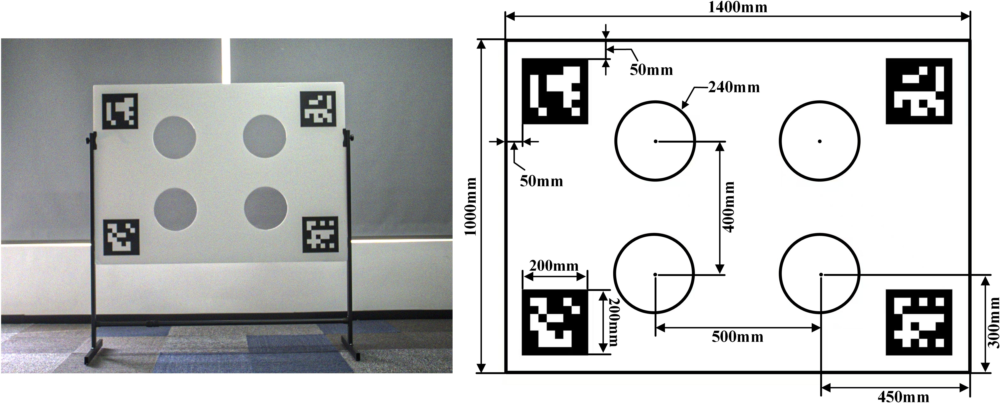
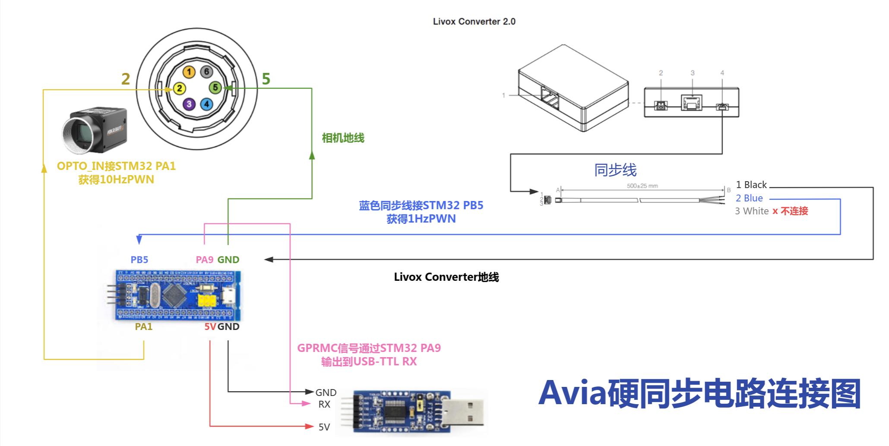

# 前置准备工作

**设备配置**：Livox Avia + 海康 MV-CU013-A0UC + STM32F103  
**系统环境**：Ubuntu 20.04 + ROS2 noetic 

---

## 目录


1. [雷达网络配置与启动](#雷达网络配置与启动)
2. [相机内参标定](#相机内参标定)
3. [相机-雷达外参标定](#相机-雷达外参标定)
4. [将标定结果写入配置文件](#将标定结果写入配置文件)
5. [硬件时间同步](#硬件时间同步)


---

## 一、雷达网络配置与启动

雷达SDK下载：https://github.com/Livox-SDK/Livox-SDK   下载时注意SDK是否支持当前雷达型号

### 1.1 网络 IP 配置

Livox Avia 默认 IP 为 **`192.168.1.175`**，主机网卡需要配置到同一网段。

**临时配置（测试用，重启后失效）：**

```bash
sudo ip addr add 192.168.1.50/24 dev eth0
```

或直接设置静态ip

**验证网络连通性：**

```bash
ip addr show eth0        # 应看到 inet 192.168.1.50/24
ping 192.168.1.175       # 应能 ping 通雷达
```

### 1.2 雷达驱动配置文件

配置文件路径：livox_ros_driver/config/livox_lidar_config.json

本设备雷达序列号为：3JEDN8D0012ZN75

**指定序列号连接（精确控制）：**

```json
{
    "lidar_config": [
        {
            "broadcast_code": "雷达序列号",
            "enable_connect": true,
            "enable_fan": true,
            "return_mode": 0,
            "coordinate": 0,
            "imu_rate": 1,
            "extrinsic_parameter_source": 0
        }
    ],
    "timesync_config": {
        "enable_timesync": false,
        "device_name": "/dev/ttyUSB0",
        "comm_device_type": 0,
        "baudrate_index": 2,
        "parity_index": 0
    }
}
```
注意：此处的enable_timesync在使用时间同步的时候应置为true 
      device_name 应该以实际的TTL串口为准
      如果直接连接树莓派而不是通过TTL的，需要修改实际的名称

### 1.3 启动雷达

启动前先确认 eth0 已有 IP：

```bash
ip addr show eth0
# 若没有 192.168.1.50，执行：
sudo ip addr add 192.168.1.50/24 dev eth0
```

**方式一：发布 CustomMsg 格式（FAST-LIVO2及外参标定使用）：**

```bash
source /opt/ros/noetic/setup.bash
source install/setup.bash
roslaunch livox_ros_driver livox_lidar_msg.launch
```

**方式二：带 RViz2 可视化（检查点云是否正常）：**

```bash
source /opt/ros/noetic/setup.bash
source install/setup.bash
roslaunch livox_ros_driver livox_lidar_rviz.launch
```

**验证话题（另开终端）：**

```bash
source /opt/ros/noetic/setup.bash
rostopic list             # 应看到 /livox/lidar 和 /livox/imu
rostopic hz /livox/lidar  # 正常约 10 Hz
rostopic hz /livox/imu    # 正常约 200 Hz
```

---

## 二、相机内参标定（张正友标定法）

> 如果已有内参文件，可跳过此节直接进行外参标定。

### 2.1 准备标定板

使用棋盘格标定板，推荐尺寸：8×6 格，每格 25 mm。打印后粘贴在平整硬板上，避免翘曲。

### 2.2 启动相机采集图像

```bash
cd /home/ub/Fast_livo2
roslaunch mvs_ros_pkg mvs_camera_trigger.launch
```
或直接通过MVS客户端采集图像

采集要求：
- 变换标定板角度和距离，采集 **20～30 张**不同姿态的图像
- 每张图像中棋盘格必须完整出现，且四周留有余量
- 光线充足，无运动模糊


### 2.3 运行标定

用matlab进行标定 参考：https://blog.csdn.net/weixin_45718019/article/details/105823053

python脚本标定 参考：https://github.com/Nocami/PythonComputerVision-6-CameraCalibration


### 2.4 将内参写入 FAST-LIVO2 配置

配置文件： src/FAST-LIVO2/config/camera_pinhole.yaml

```yaml
/**:
    cam_model: Pinhole
    cam_width: 1280
    cam_height: 1024
    scale: 0.5
    cam_fx: 1258.2152870533384
    cam_fy: 1258.3999409785761
    cam_cx: 639.51191223848059
    cam_cy: 530.66378283843449
    cam_d0: -0.073685045253835152
    cam_d1: 0.081916678099937495
    cam_d2: -0.00023046923408783635
    cam_d3: -0.00092201539173782771
```

> **注意**：若 mvs_ros_driver 配置了 `scale: 0.5`，则标定获得的内参需要 ×2 后再填入。

---

## 三、相机-雷达外参标定

使用工具：FAST-Calib:https://github.com/hku-mars/FAST-Calib

标定板如图：  使用 DICT_6X6_250 字典  id顺序依次为 左上（1） 右上（2） 左下（3） 右下（4）

标定全程设备不可移动，标定板最好悬挂

### 3.1 标定板参数（根据实际数据修改）

| 参数 | 值 |
|------|----|
| ArUco 字典 | DICT_6X6_250 |
| 标记 ID | 左上=1，右上=2，左下=3，右下=4 |
| 单个标记边长 | 20 cm |
| 标记水平中心距（半值） | `delta_width_qr_center = 0.65` |
| 标记垂直中心距（半值） | `delta_height_qr_center = 0.45` |
| 圆心水平间距 | `delta_width_circles = 0.4` |
| 圆心垂直间距 | `delta_height_circles = 0.5` |
| 空心圆半径 | `circle_radius = 0.12` |

> 更换标定板后必须重新测量并更新 `qr_params.yaml`。

### 3.2 步骤 1：启动雷达（终端 A）

```bash
source /opt/ros/noetic/setup.bash
source install/setup.bash
roslaunch livox_ros_driver livox_lidar_rviz.launch
```

等待终端出现 `Lidar Connect` 字样后保持运行。

### 3.3 步骤 2：拍摄相机标定图片（终端 B）

将标定板放置在距相机 **1.2～2.0 m** 处，确保四个 ArUco 标记完整入镜。

MVS拍摄即可 记录图片保存路径，后续填写配置文件时使用。

### 3.4 步骤 3：录制雷达点云 rosbag（终端 C）

```bash
source /opt/ros/noetic/setup.bash
rosbag record /livox/lidar \
  -o /home/ub/Fast_livo2/src/FAST-Calib/calib_data/my_calib/pointcloud
```

录制 **5～10 秒**后按 `Ctrl+C` 停止。

### 3.5 步骤 4：修改标定配置文件

```bash
nano /home/ub/Fast_livo2/src/FAST-Calib/config/qr_params.yaml
```

> `bag_path` 必须指向含有 `metadata.yaml` 的那一级目录，不能多填或少填路径层级。

### 3.6 步骤 5：运行标定算法（终端 D）

```bash
roslaunch fast_calib calib.launch
```

### 3.7 查看标定结果

```bash
cat /home/ub/Fast_livo2/src/FAST-Calib/output/calib_result.txt
```

输出示例：

```
Rcl: [ -0.013069,  -0.999886,  -0.007569,
        0.027500,   0.007208,  -0.999596,
        0.999537,  -0.013272,   0.027403]
Pcl: [ -0.206532,  -0.076525,  -1.119885]
```

**RMSE 质量判断：**

| RMSE | 质量 |
|------|------|
| < 0.03 m | 优秀 |
| 0.03～0.05 m | 良好 |
| 0.05～0.08 m | 可用 |
| > 0.08 m | 需重新标定 |

---

## 四、将标定结果写入配置文件

编辑 FAST-LIVO2 的传感器配置文件（Avia 对应 `avia.yaml`）：

```bash
# Avia
nano /home/ub/Fast_livo2/src/FAST-LIVO2/config/avia.yaml
```

找到 `extrin_calib` 部分，将 `calib_result.txt` 中的值填入：

```yaml
extrin_calib:
  Rcl: [-0.013069, -0.999886, -0.007569,
         0.027500,  0.007208, -0.999596,
         0.999537, -0.013272,  0.027403]
  Pcl: [-0.206532, -0.076525, -1.119885]
```

> `Rcl` 是旋转矩阵（3×3，行优先展开），`Pcl` 是平移向量（单位：米）。

---


## 五、硬时间同步

### 5.1 代码及接线图

代码：https://github.com/xuankuzcr/LIV_handhold/tree/main/stm32_timersync-open

接线图：

参考：https://li-shuangyi.github.io/2025/07/04/%E5%A4%8D%E7%8E%B0FAST-LIVO2/  


---

## 附：常见问题排查


### ArUco 检测不到（Found 0 markers）

1. 图片中四个标记未完整出现 → 重新拍摄，标定板需完整入镜
2. 标记 ID 不匹配 → 确认使用 DICT_6X6_250 字典，ID 为 1、2、3、4
3. 光线过暗或曝光过度 → 调整光线重拍
4. 标定板弯曲变形 → 固定在硬质平板上


### 雷达找不到设备

```bash
ip addr show eth0              # 确认 eth0 有 192.168.1.50/24
ping 192.168.1.175             # 确认雷达可 ping 通
sudo tcpdump -i eth0 -n udp port 55000  # 查看雷达广播包
```

### RMSE 偏大（> 0.08 m）

- 重新精确测量标定板尺寸，更新 `qr_params.yaml`
- 检查 `x_min/x_max` 距离滤波范围是否覆盖标定板实际位置
- 标定板尽量正对相机，避免过大倾斜角
- 考虑重新进行相机内参标定

---

## 快速命令速查

```bash

# ② 配置雷达网络 IP（如未配置）
sudo ip addr add 192.168.1.50/24 dev eth0

# ③ 启动雷达（终端 A）
roslaunch livox_ros2_driver livox_lidar_msg.launch

# ④ 拍摄标定图片（终端 B）(用MVS采集)
cd /opt/MVS/bin
./MVS

# ⑤ 录制雷达 rosbag（终端 C，5~10 秒后 Ctrl+C）
rosbag record /livox/lidar \
  -o /home/ub/Fast_livo2/src/FAST-Calib/calib_data/my_calib/pointcloud

# ⑥ 修改配置（bag_path 和 image_path）
nano /home/ub/Fast_livo2/src/FAST-Calib/config/qr_params.yaml

# ⑦ 运行外参标定（终端 D）
roslaunch fast_calib calib.launch

# ⑧ 查看标定结果
cat /home/ub/Fast_livo2/src/FAST-Calib/output/calib_result.txt
```

后续采集数据包的命令见README.md